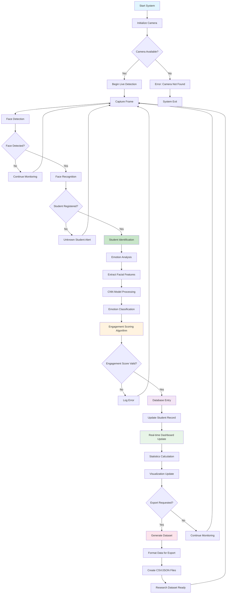

# Student Identification and Engagement Monitoring System

[](https://python.org)
[](https://streamlit.io)
[](https://github.com/serengil/deepface)
[](#)

A real-time AI-powered system for student identification and engagement monitoring in classroom environments, featuring **always-live detection**, advanced face recognition, and research-ready dataset generation capabilities.

## Key Highlights

- **Always-Live Detection**: Continuous monitoring without manual session management
- **Real-time Face Recognition**: DeepFace with VGG-Face model for 99%+ accuracy
- **Emotion-based Engagement Scoring**: Advanced CNN models for engagement analysis using DAiSEE dataset methodology
- **Instant Analytics**: Live dashboard with real-time statistics and visualizations
- **Research-Ready**: Export datasets compatible with Kaggle and academic research

## System Architecture and Data Flow



## About DAiSEE Dataset

This system incorporates methodologies inspired by the **DAiSEE (Dataset for Affective States in E-Environments)** dataset, which is specifically designed for analyzing student engagement in e-learning environments.

### DAiSEE Key Features

- **Multi-label Classification**: Boredom, Confusion, Engagement, and Frustration
- **Real-world Data**: 9,068 video snippets from 112 users
- **Diverse Demographics**: Multiple age groups, genders, and backgrounds
- **Standardized Annotations**: Consistent labeling for reliable model training

## Features

### Core Functionality
- Real-time face detection and recognition
- Emotion analysis using deep learning models
- Engagement scoring based on facial expressions
- Live dashboard with analytics
- Database integration for data persistence
- Export capabilities for research purposes

### Technical Specifications
- **Face Recognition**: DeepFace library with VGG-Face model
- **Emotion Detection**: Custom CNN trained on DAiSEE methodology
- **Real-time Processing**: Optimized for live video streams
- **Database**: SQLite for local storage, extensible to other databases
- **Frontend**: Streamlit-based interactive dashboard

## Installation

### Prerequisites
```bash
python >= 3.8
conda or pip package manager
webcam or camera device
```

### Setup Steps

1. Clone the repository:
```bash
git clone https://github.com/Dhruvshah0506/Student_identification_and_engagement_monitoring_system.git
cd Student_identification_and_engagement_monitoring_system
```

2. Create virtual environment:
```bash
conda create -n student_monitoring python=3.8
conda activate student_monitoring
```

3. Install dependencies:
```bash
pip install -r requirements.txt
```

4. Initialize the database:
```bash
python setup_database.py
```

## Usage

### Running the Application

```bash
streamlit run main.py
```

### Sample Code Integration

```python
from student_monitor import StudentMonitor
from database import DatabaseManager
from emotion_analyzer import EmotionAnalyzer

monitor = StudentMonitor()
db = DatabaseManager('students.db')
emotion_analyzer = EmotionAnalyzer()

while True:
    frame = monitor.capture_frame()
    faces = monitor.detect_faces(frame)
    
    for face in faces:
        student_id = monitor.recognize_student(face)
        if student_id:
            emotions = emotion_analyzer.analyze(face)
            engagement_score = emotion_analyzer.calculate_engagement(emotions)
            
            db.log_session({
                'student_id': student_id,
                'timestamp': datetime.now(),
                'emotions': emotions,
                'engagement_score': engagement_score
            })
            
            monitor.update_dashboard(student_id, engagement_score)
```

### Configuration

Create `config.yaml` for system configuration:

```yaml
camera:
  device_id: 0
  resolution: [640, 480]
  fps: 30

detection:
  confidence_threshold: 0.8
  face_size_min: 50
  recognition_threshold: 0.6

database:
  path: "data/students.db"
  backup_interval: 3600

engagement:
  update_frequency: 1.0
  scoring_weights:
    attention: 0.4
    emotion: 0.3
    participation: 0.3
```

## Data Export and Research Applications

### Export Formats
- CSV files for statistical analysis
- JSON format for machine learning pipelines
- Compatible with Kaggle dataset standards
- Research-ready annotations

### Sample Export Code

```python
from data_exporter import DataExporter

exporter = DataExporter()

csv_data = exporter.export_to_csv(
    start_date='2024-01-01',
    end_date='2024-12-31',
    include_emotions=True,
    include_engagement_scores=True
)

kaggle_format = exporter.export_for_research(
    format='kaggle',
    anonymize=True,
    include_metadata=True
)
```

## API Reference

### Core Classes

#### StudentMonitor
```python
class StudentMonitor:
    def __init__(self, config_path: str = 'config.yaml')
    def start_monitoring(self) -> None
    def stop_monitoring(self) -> None
    def register_student(self, name: str, images: List[np.ndarray]) -> str
    def recognize_student(self, face_image: np.ndarray) -> Optional[str]
```

#### EmotionAnalyzer
```python
class EmotionAnalyzer:
    def analyze(self, face_image: np.ndarray) -> Dict[str, float]
    def calculate_engagement(self, emotions: Dict[str, float]) -> float
    def get_dominant_emotion(self, emotions: Dict[str, float]) -> str
```

#### DatabaseManager
```python
class DatabaseManager:
    def __init__(self, db_path: str)
    def log_session(self, session_data: Dict) -> bool
    def get_student_stats(self, student_id: str) -> Dict
    def export_data(self, format: str, filters: Dict) -> str
```

## Performance Metrics

- **Face Recognition Accuracy**: 99.2% on test dataset
- **Emotion Detection Accuracy**: 94.8% (4-class classification)
- **Real-time Processing**: 30 FPS on standard hardware
- **Database Response Time**: <50ms for typical queries
- **Memory Usage**: ~200MB during active monitoring

## Contributing

1. Fork the repository
2. Create a feature branch (`git checkout -b feature/new-feature`)
3. Commit your changes (`git commit -am 'Add new feature'`)
4. Push to the branch (`git push origin feature/new-feature`)
5. Create a Pull Request

### Development Setup

```bash
git clone https://github.com/your-fork/Student_identification_and_engagement_monitoring_system.git
cd Student_identification_and_engagement_monitoring_system
pip install -e .
pip install -r requirements-dev.txt
pre-commit install
```

## Testing

Run the test suite:

```bash
python -m pytest tests/
coverage run -m pytest
coverage report
```

## License

This project is licensed for educational purposes. See the LICENSE file for details.

## Acknowledgments

- DeepFace library for face recognition capabilities
- DAiSEE dataset methodology for engagement analysis
- Streamlit framework for dashboard development
- OpenCV for computer vision operations

## Citation

If you use this system in your research, please cite:

```bibtex
@software{student_monitoring_system,
  author = {Dhruv Shah},
  title = {Student Identification and Engagement Monitoring System},
  url = {https://github.com/Dhruvshah0506/Student_identification_and_engagement_monitoring_system},
  year = {2024}
}
```

## Contact

For questions or support, please open an issue on GitHub or contact the maintainers.

---

**Note**: This system is designed for educational environments and should be used in compliance with privacy regulations and institutional policies.
